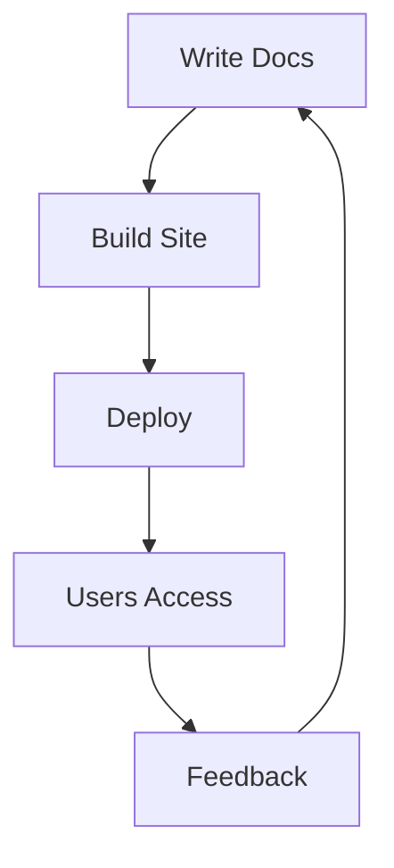

# Examples

This page provides practical examples of using the MkDocs template with Material theme.

## Basic Content Examples

### Code Blocks with Syntax Highlighting

=== "Python"

    ```python
    def hello_world():
        """A simple hello world function."""
        print("Hello, World!")
        print("Hello from the library!")

    if __name__ == "__main__":
        hello_world()
    ```

=== "JavaScript"

    ```javascript
    function helloWorld() {
        console.log("Hello, World!");
        console.log("Hello from the library!");
    }

    helloWorld();
    ```

=== "Rust"

    ```rust
    fn main() {
        println!("Hello, World!");
        println!("Hello from the library!");
    }
    ```

### Admonitions

!!! note "Information"
    This is a note admonition. Use it for helpful information.

!!! tip "Pro Tip"
    You can use different types of admonitions for different purposes.

!!! warning "Warning"
    Be careful when modifying configuration files.

!!! danger "Danger"
    This could cause issues if not handled properly.

### Task Lists

- [x] Set up MkDocs template
- [x] Configure Material theme
- [x] Add example content
- [ ] Customize for your project
- [ ] Deploy to production

### Tables

| Feature | Nix | Docker | Manual |
|---------|-----|--------|--------|
| Reproducible | ✅ | ✅ | ❌ |
| Isolated | ✅ | ✅ | ❌ |
| Fast Setup | ✅ | ✅ | ❌ |
| No Dependencies | ❌ | ✅ | ❌ |

## Advanced Examples

### Custom Content Tabs

=== "Development"

    ```bash
    # Start development server
    nix develop
    mkdocs serve
    ```

    Open [http://127.0.0.1:8000](http://127.0.0.1:8000) in your browser.

=== "Production"

    ```bash
    # Build for production
    nix run .#build

    # Or with Docker
    docker build -t my-docs .
    docker run -p 8080:80 my-docs
    ```

=== "Deployment"

    ```bash
    # Deploy to GitHub Pages
    nix run .#deploy

    # Or manually
    mkdocs gh-deploy
    ```

### Mathematical Expressions

You can enable MathJax for mathematical expressions:

$$
E = mc^2
$$

Inline math: $f(x) = x^2 + 2x + 1$

### Mermaid Diagrams



### Collapsible Sections

??? "Click to expand"
    This content is initially hidden and can be expanded by clicking.

    ```yaml
    # Example configuration
    theme:
      name: material
      features:
        - content.code.fold
    ```

???+ "Expanded by default"
    This section is expanded by default but can be collapsed.

## Integration Examples

### GitHub Actions Workflow

```yaml title=".github/workflows/docs.yml"
name: Deploy Documentation

on:
  push:
    branches: [ main ]

jobs:
  deploy:
    runs-on: ubuntu-latest
    steps:
    - uses: actions/checkout@v3

    - name: Setup Python
      uses: actions/setup-python@v4
      with:
        python-version: '3.12'

    - name: Install dependencies
      run: |
        pip install mkdocs mkdocs-material

    - name: Deploy
      run: mkdocs gh-deploy --force
```

### Custom Hook Scripts

```python title="hooks/custom_hook.py"
def on_page_markdown(markdown, page, config, files):
    """Custom hook to modify page content."""
    if page.title == "Examples":
        markdown += "\n\n*This page was processed by a custom hook.*"
    return markdown
```

### Environment-Specific Configuration

```yaml title="mkdocs.prod.yml"
# Production-specific configuration
site_url: https://your-domain.com
extra:
  analytics:
    provider: google
    property: G-XXXXXXXXXX
```

## Template Output Verification

Both Nix and Docker builds should produce:

```
Hello, World!
Hello from the library!
```

This ensures consistency with other language templates in the project.

### Verification Commands

=== "Nix"

    ```bash
    nix run .#default
    # Should output:
    # Hello, World!
    # Hello from the library!
    ```

=== "Docker"

    ```bash
    docker build -t mkdocs-template .
    docker run mkdocs-template
    # Should output:
    # Hello, World!
    # Hello from the library!
    # (then start nginx)
    ```

## Best Practices

1. **Consistent Navigation**: Keep navigation structure logical and consistent
2. **Code Examples**: Always provide working code examples
3. **Cross-References**: Link related pages and sections
4. **Responsive Design**: Test on different screen sizes
5. **Performance**: Use minification and optimization plugins

## Next Steps

- Customize the theme colors and fonts
- Add more plugins for enhanced functionality
- Set up automated deployment
- Create custom templates for repeated content patterns
